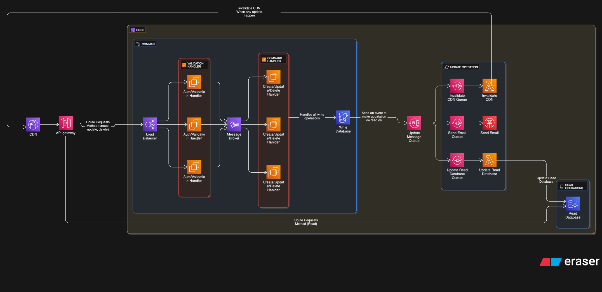

# CQRS (Command Query Responsibility Segregation) System

> CQRS (Command Query Responsibility Segregation) is a system design patterns where we make separation between **read/write** databases, which make ours system more scalable, resilience and cleaner.

## Key concept

1. **Separation of Concerns**: CQRS separates the read and write operations into different models. The write model handles commands (operations that change state), while the read model handles queries (operations that retrieve data).
2. **Event Sourcing:** With CQRS, it's common to use event sourcing, where state changes are stored as a sequence of events using (e.g., EventStore, Kafka). This allows for better auditing, debugging, and the ability to reconstruct past states.
3. **Scalability**: By separating read and write operations, each can be scaled independently based on demand. For example, read operations can be optimized for fast retrieval, while write operations can focus on data integrity.
4. **Flexibility**: Different data storage technologies can be used for read and write models. For instance, a relational database might be used for writes, while a NoSQL database could be used for reads.
5. **Complexity**: Implementing CQRS can introduce additional complexity to the system, as it requires managing two separate models and ensuring consistency between them.
6. **Consistency**: CQRS often leads to eventual consistency between the read and write models, which means this design is not suitable for applications like banking systems that require strong consistency.

## Example Architecture

- In the above architecture, we have two main components: the Command Side and the Query Side.

- The Command Side is responsible for handling commands that modify the state of the system. It typically uses a write-optimized database to store data.
- The Query Side is responsible for handling queries that retrieve data from the system. It uses a read-optimized database to provide fast access to data.
- In Command Side, we have:
  - **Validation Handler:** Validates incoming commands to ensure they meet business rules.
  - **Kafka:** Acts as a message broker between the Validation Handler and the Command Handler.
  - **Command Handler:** Processes validated commands and applies changes to the write database.
  - **Write Database:** Stores the current state of the system.
- In Query Side, we have:
  - **Message Queue:** Receives events from the Command Side to update the read database.
  - **Send Email Queue:** Receives events in a queue to send email notifications using services like AWS SES.
  - **Invalidate CDN Queue:** Receives events to invalidate cached content in a CDN like Cloudflare.
  - **Update Database Queue:** Receives events to update the read database.
  - **Read Database:** Optimized for fast data retrieval to serve queries efficiently.
- The system ensures that commands and queries are handled separately, allowing for better performance, scalability, and maintainability.
